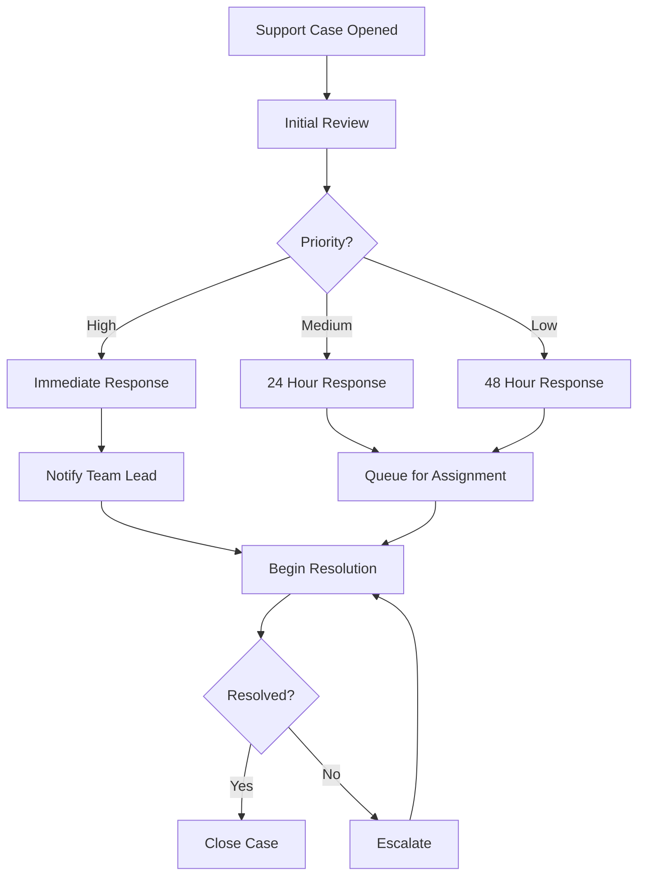

# Support Process Documentation

{width=400px .right}

## Overview
This document outlines our support process including both standard procedures and mermaid diagrams for visualization.

## Process Flow
Here's how our support process works:

## Response Times

| Priority | Response Time | Update Frequency |
|----------|--------------|------------------|
| High     | Immediate    | Every 2 hours    |
| Medium   | 24 hours     | Daily            |
| Low      | 48 hours     | Bi-weekly        |

## Additional Notes
* Team leads must be notified for all high-priority cases
* Updates must be documented in the ticketing system
* All escalations require a handover document

### Important Reminders
1. Always check for existing similar cases
2. Document all customer communications
3. Follow up after resolution for customer satisfaction

> **Note**: This process is subject to regular review and updates based on team feedback and performance metrics.