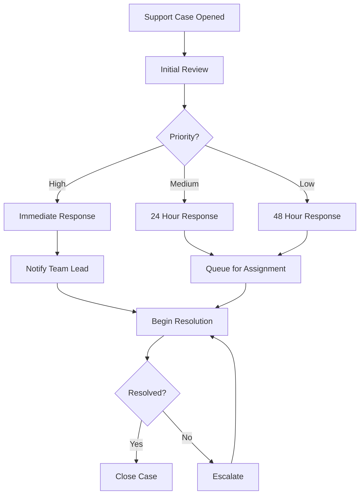

# Test Presentation
Created for testing Marp CLI conversion

---

## What is this?
This is a test slide deck for verifying:
* Marp installation
* PDF conversion
* Theme application
* Basic formatting

---

## Code Example
```python
def hello():
    print("Hello from test deck!")
```

---

<!-- Split layout with columns -->
## Mermaid Diagram

<div class="columns">
<div>

Here's the Mermaid code that generates the diagram:



</div>
<div>

The rendered diagram:


</div>
</div>

<style>
.columns {
    display: grid;
    grid-template-columns: repeat(2, minmax(0, 1fr));
    gap: 1rem;
}
</style>

---

## Logo Example


---

## Table Example
| Item | Description |
|------|-------------|
| Test 1| First test |
| Test 2| Second test|

---

# Thank You
End of test presentation